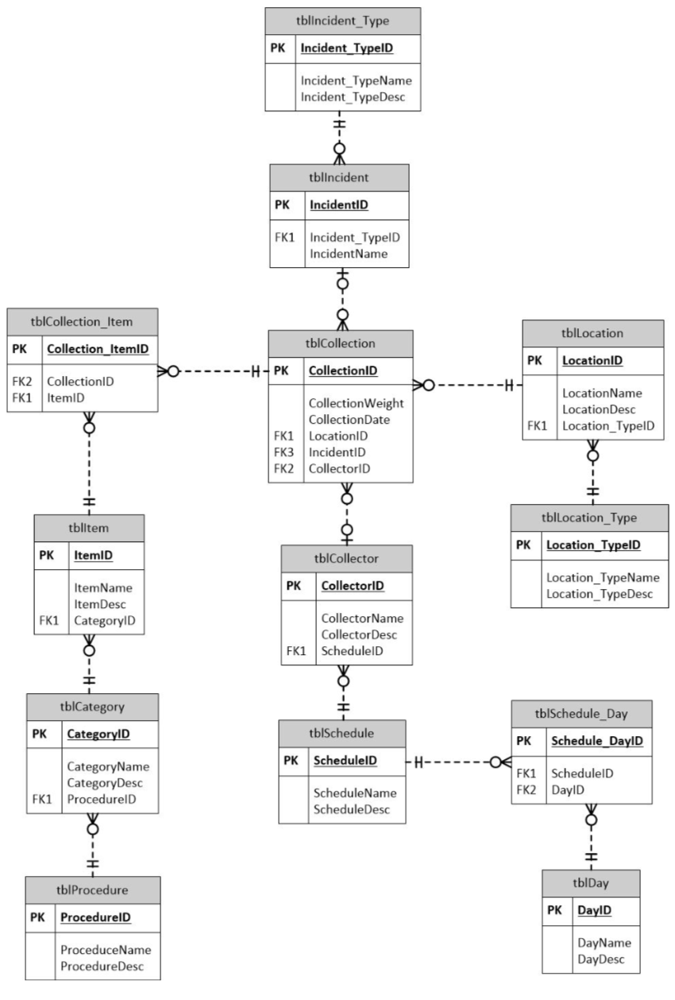

# Waste Management Database

This is a database for waste collection at University of Washington that can be used to:
- Categorize waste and their respective proper disposal procedures
- Improve safety and health
- Improve sustainability
- Eliminate accidents and hazards
- Connect each “collection” of waste to a collector
- Track locations to be collected from
- Track schedule of collectors
- Track incidents during collections

## ERD

